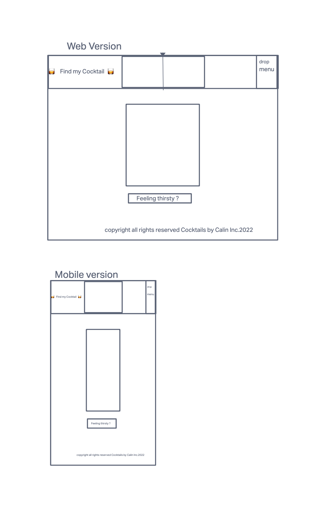
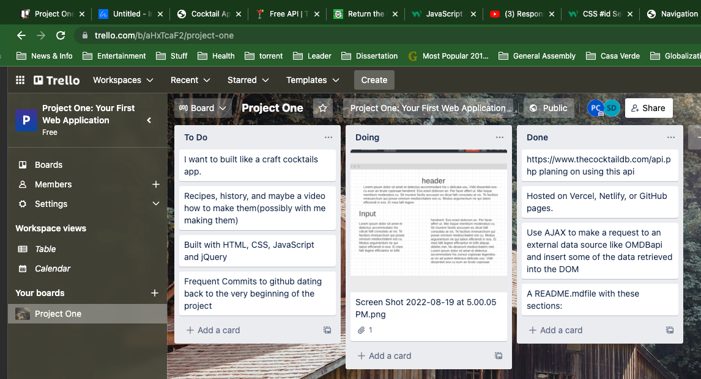
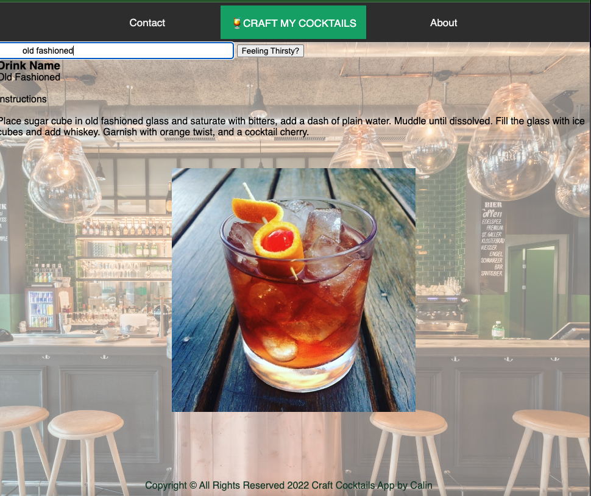

# Craft-Cocktails-App

A simple webb app visualizing and randoom choosing cocktails recipes.

## Technologies
- HTML5
- CSS3
- JavaScript/jQuery
- [CocktailsDB API](https://www.thecocktaildb.com/api.php?ref=apilist.fun)

## Screenshots

### Wireframes

### Planing
Trello

## Features
Users can search through a data base to retrieve cocktails recepis

## Design
- Design elements impletented using HTML5 and CSS

### Images of Working App

### Getting Started
[Click here](#) to see working app

## Future Enhancements
- Routing
- Users will be able to rate the cocktails they like
- Users can add cocktails